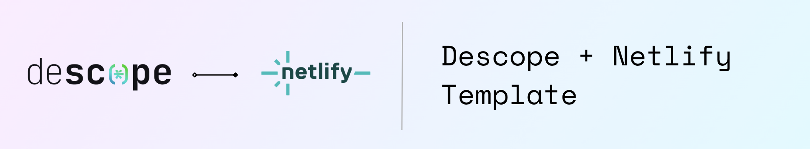

# Netlify + Descope Next.js Template

This template allows you to instantly deploy an app with Descope Authentication to Netlify. This is great for Next.js developers who want to quickly create deployable applications with advanced auth methods. :zap:

## Getting Started 🚀

Follow these steps to clone the repository and start using the app.

### Prerequisites

- An account on [Descope](https://descope.com/).

### Clone the Repository

Start by cloning the repository to your local machine:

```bash
git clone https://github.com/descope-sample-apps/descope-netlify-template
cd descope-netlify-template
```

### Install Dependencies

Navigate to the project directory and install the necessary dependencies:

```bash
npm i
npm install netlify-cli -g
npm install @descope/nextjs-sdk
```

### Connect To Netlify

The Netlify initialization script will walk you through how to connect to a new or existing Netlify project.

```bash
netlify init
```

### Configuration

Before you run the app, make sure to configure the following:

- **Environment Variables**: Set up your environment variables in a `.env.local` file or on the Netlify project dashboard under site configuration -> Environment variables. You'll need to include your Descope project settings:

```
####### Descope ENV Variables
NEXT_PUBLIC_DESCOPE_PROJECT_ID="" // Descope Project ID
NEXT_PUBLIC_DESCOPE_FLOW_ID="" // Descope flow to use on Sign In Page
```

### Running the App

Once you've configured your app, you're ready to run it:

```bash
npm run dev
# or
yarn dev
```

This command starts the Next.js development server, making your app accessible at [http://localhost:3000](http://localhost:3000).

## Support :raised_hands:

If you encounter any issues or have questions, consult the Netlify and Descope documentation, or reach out to our [support](https://www.descope.com/contact) for assistance.

- [Netlify Documentation](https://docs.netlify.com/)
- [Descope Documentation](https://docs.descope.com/)

## Contributing

Contributions are welcome! Please feel free to submit a pull request or open an issue if you have suggestions or improvements.

## License

This sample app is open-source and available under the MIT License. See the LICENSE file for more details.
